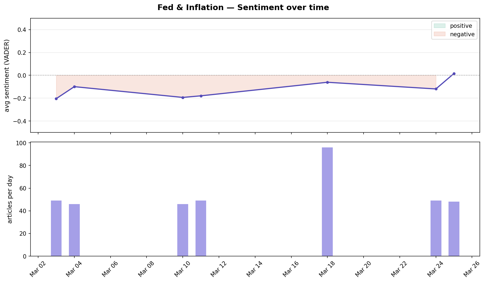
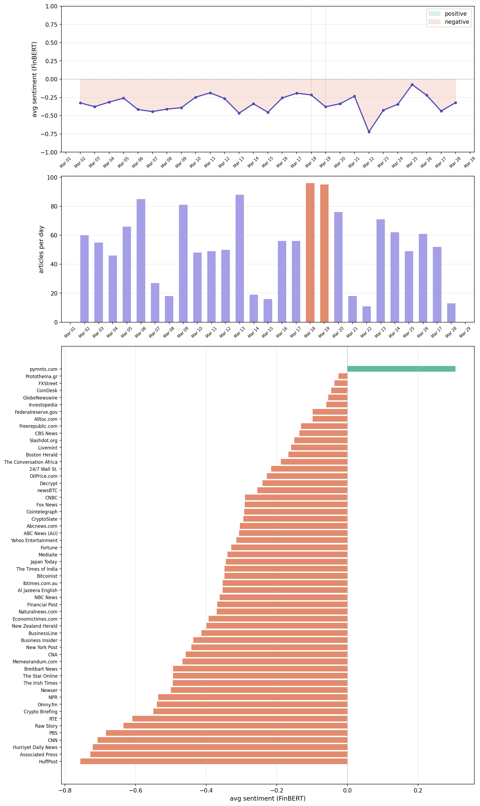
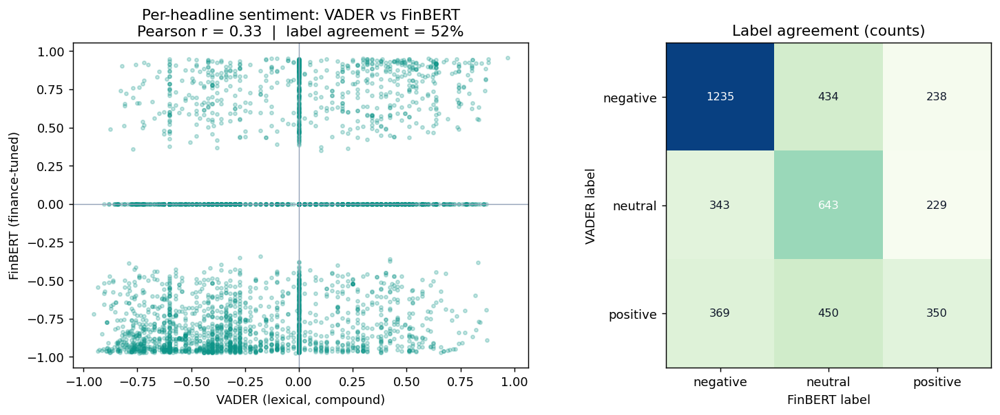

# fed-sentiment-tracker

A multi-layer NLP pipeline that monitors Federal Reserve and inflation sentiment across financial news, flags anomaly days, and uses a Claude agentic loop to investigate why sentiment moved.

## Why

Macro headlines move markets, but a single day's sentiment is noisy. This pipeline separates the signal — building a daily baseline across outlets, flagging days that break the baseline on either volume or sentiment, and then drilling into _why_ via an agent that reads the news for you.

## Architecture

Three layers, each in its own notebook, plus a production runner in `pipeline.py`.

| Layer | Notebook | What it does |
|---|---|---|
| **1 — VADER baseline** | `layer1_sentiment.ipynb` | Pull Fed/inflation headlines via NewsAPI, score each with VADER, build per-outlet daily sentiment as a quick lexical baseline. |
| **2 — FinBERT + cross-outlet trends** | `layer2_sentiment.ipynb` | Re-score the same corpus with FinBERT (finance-tuned), aggregate to daily mean sentiment + article volume, compute z-scored heat and anomaly flags across outlets. |
| **3 — Claude agentic investigation** | `layer3_agent.ipynb` | For each anomaly day, run a Claude Sonnet agent with `web_search` to investigate the cause, then produce a structured report (keywords, summary, investment watchout, sources). |

`pipeline.py` chains layers 2 + 3 end-to-end for the scheduled runner.

## Sample output

Per-outlet daily sentiment (Layer 1):



Cross-outlet daily mean sentiment with anomaly band (Layer 2):



Investigation reports for flagged anomaly days are written to `investigation_reports.json` (days where the agent surfaces no usable findings are skipped, not written).

## VADER vs. FinBERT — do they actually agree?

Layer 1 (VADER, lexical) and Layer 2 (FinBERT, finance-tuned) score the **same 4,291 headlines**. They agree on only **52% of labels** (Pearson **r = 0.33**) — and the disagreements are the whole point: VADER reacts to tone words, FinBERT to financial framing.



| Headline | VADER | FinBERT |
|---|:--:|:--:|
| "Gas prices set to rise amid U.S.–Israeli war with Iran" | −0.60 | **+0.87** |
| "No Fury in Stock Market: U.S. Stocks Mixed as Energy Prices Climb" | +0.62 | **−0.91** |
| "US Manufacturing Grew, Input Costs Soared Before Iran Attack" | −0.48 | **+0.91** |

Reproduce with `python vader_vs_finbert.py`. This is why the pipeline keeps both scorings rather than picking one.

## How to run

```bash
# deps
pip install -r requirements.txt

# secrets — put these in a .env at repo root
NEWS_API_KEY=...
ANTHROPIC_API_KEY=...

# one-shot run: fetch incrementally, score with FinBERT, investigate new anomaly days
python pipeline.py
```

Or step through the notebooks in order (`layer1` → `layer2` → `layer3`) to see the logic developed layer by layer.

## Automation

`.github/workflows/daily_pipeline.yml` runs the pipeline on a cron each weekday at 8am EST and auto-commits `daily_sentiment.csv`, `daily_aggregate.csv` + `investigation_reports.json`. The committed dataset covers daily runs from March 2 through June 11, 2026 (4,291 scored headlines); the cron is currently paused and can be restarted with `gh workflow run daily_pipeline.yml`.

## What this taught me

- **Lexical vs. domain-tuned sentiment.** VADER and FinBERT disagree on finance text in informative ways — VADER reacts to tone words, FinBERT to financial framing. Comparing them is more useful than picking one.
- **Anomaly detection is the cheap part; explanation is the hard part.** Flagging an outlier day with z-scores is a few lines. Saying _why_ it moved requires reading the news — which is exactly where an agent with web search earns its keep.
- **Agentic loops need explicit budgets.** Capping the agent at 3 web searches and 6 turns keeps cost predictable without breaking the investigation quality.
- **Separation of concerns saves tokens.** The investigation pass uses web search; a second, search-free pass formats the report. Cheaper, and the structure is more consistent.
- **NLP for finance signals lives in the aggregation, not the model.** Per-outlet z-scores and cross-outlet medians do more work than any single classifier upgrade.
